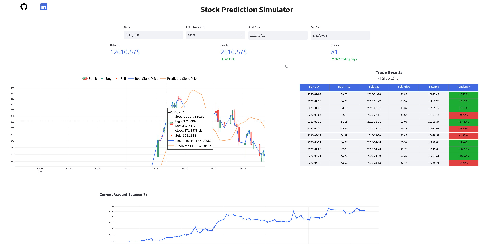

<!-- Improved compatibility of back to top link: See: https://github.com/othneildrew/Best-README-Template/pull/73 -->
<a name="readme-top"></a>
<!--
*** Thanks for checking out the Best-README-Template. If you have a suggestion
*** that would make this better, please fork the repo and create a pull request
*** or simply open an issue with the tag "enhancement".
*** Don't forget to give the project a star!
*** Thanks again! Now go create something AMAZING! :D
-->


<!-- PROJECT SHIELDS -->
<!--
*** I'm using markdown "reference style" links for readability.
*** Reference links are enclosed in brackets [ ] instead of parentheses ( ).
*** See the bottom of this document for the declaration of the reference variables
*** for contributors-url, forks-url, etc. This is an optional, concise syntax you may use.
*** https://www.markdownguide.org/basic-syntax/#reference-style-links
-->
[![LinkedIn][linkedin-shield]][linkedin-url]


<!-- PROJECT LOGO -->
<br />
<div align="center">
  <a href="https://github.com/github_username/repo_name">
    
  </a>

<h1 align="center">Stock Prediction Simulator</h1>

  <p align="center">
    Lorem Ipsum is simply dummy text of the printing and typesetting industry. Lorem Ipsum has been the industry's standard dummy text ever since the 1500s, when an 		unknown printer took a galley of type and scrambled it to make a type specimen book. It has survived not only five centuries, but also the leap into electronic typesetting, remaining essentially unchanged. It was popularised in the 1960s with the release of Letraset sheets containing Lorem Ipsum passages, and more recently with desktop publishing software like Aldus PageMaker including versions of Lorem Ipsum.
  </p>
</div>

<br />
<br />

<!-- TABLE OF CONTENTS -->
<details>
  <summary>Table of Contents</summary>
  <ol>
    <li>
      <a href="#about-the-project">About The Project</a>
      <ul>
        <li><a href="#built-with">Built With</a></li>
      </ul>
    </li>
    <li>
      <a href="#getting-started">Getting Started</a>
      <ul>
        <li><a href="#prerequisites">Prerequisites</a></li>
        <li><a href="#installation">Installation</a></li>
      </ul>
    </li>
    <li><a href="#usage">Usage</a></li>
    <li><a href="#roadmap">Roadmap</a></li>
    <li><a href="#contributing">Contributing</a></li>
    <li><a href="#license">License</a></li>
    <li><a href="#contact">Contact</a></li>
    <li><a href="#acknowledgments">Acknowledgments</a></li>
  </ol>
</details>


<!-- ABOUT THE PROJECT -->
## About The Project

<a href="http://ec2-54-90-68-112.compute-1.amazonaws.com/">
    
</a>

<br />
<br />
<br />

### Built With

* [![Python][Python-logo]](https://pythonprogramming.net/)
* [![Streamlit][Streamlit-logo]](https://streamlit-io.translate.goog/?_x_tr_sl=en&_x_tr_tl=fr&_x_tr_hl=fr&_x_tr_pto=sc)
* [![Amazon][Amazon-logo]](https://aws.amazon.com/fr/ec2/)
* [![Docker][Docker-logo]](https://www.docker.com/)
* [![Plotly][Plotly-logo]](https://plotly.com/)
* [![Tensorflow][Tensorflow-logo]](https://www.tensorflow.org/)
* [![Yahoo Finance][Yahoo-Finance]](https://pypi.org/project/yfinance/)


<br />
<br />

<!-- Dataset -->
## Dataset

### Yahoo Finance API (yfinance)

#### a. Request
``` 
yfinance.download(tickers=TSLA,
		  start="2010-08-12",
		  end="2022-09-03",
		  interval="1d",
		  group_by='ticker',
		  # Mass Downloading
		  threads=True,
		  proxy=None
		 )
```

#### b. Response Format

| Date  | Open | High | Low | Close | Adj Close | Volume | 
| ----- | -----| ---- | ----| ----- | --------- | ------ |
| (Object) | (float64) | (float64) | (float64) | (float64) | (float64) | (int64) |


<br />

### Preprocessing

<a>
    
</a>


<!-- Model -->
## Model


<!-- Results -->
## Results


<!-- CONTACT -->
## Contact

Your Name - [@twitter_handle](https://twitter.com/twitter_handle) - email@email_client.com

Project Link: [https://github.com/github_username/repo_name](https://github.com/github_username/repo_name)

<p align="right">(<a href="#readme-top">back to top</a>)</p>


<!-- MARKDOWN LINKS & IMAGES -->
<!-- https://www.markdownguide.org/basic-syntax/#reference-style-links -->
[contributors-shield]: https://img.shields.io/github/contributors/github_username/repo_name.svg?style=for-the-badge
[contributors-url]: https://github.com/github_username/repo_name/graphs/contributors
[forks-shield]: https://img.shields.io/github/forks/github_username/repo_name.svg?style=for-the-badge
[forks-url]: https://github.com/github_username/repo_name/network/members
[stars-shield]: https://img.shields.io/github/stars/github_username/repo_name.svg?style=for-the-badge
[stars-url]: https://github.com/github_username/repo_name/stargazers
[issues-shield]: https://img.shields.io/github/issues/github_username/repo_name.svg?style=for-the-badge
[issues-url]: https://github.com/github_username/repo_name/issues
[license-shield]: https://img.shields.io/github/license/github_username/repo_name.svg?style=for-the-badge
[license-url]: https://github.com/github_username/repo_name/blob/master/LICENSE.txt
[linkedin-shield]: https://img.shields.io/badge/-LinkedIn-black.svg?style=for-the-badge&logo=linkedin&colorB=555
[linkedin-url]: https://linkedin.com/in/linkedin_username
[product-screenshot]: images/screenshot.png
[Python-logo]: https://img.shields.io/badge/Python-20232A?style=for-the-badge&logo=python&logoColor=white
[Yahoo-Finance]: https://img.shields.io/badge/Yahoo%20Finance%20API-6001D2?style=for-the-badge&logo=yahoo&logoColor=white
[Streamlit-logo]: https://img.shields.io/badge/Streamlit-FF4B4B?style=for-the-badge&logo=streamlit&logoColor=white
[Plotly-logo]: https://img.shields.io/badge/Plotly-3F4F75?style=for-the-badge&logo=plotly&logoColor=white
[Amazon-logo]: https://img.shields.io/badge/Amazon%20EC2-FF9900?style=for-the-badge&logo=amazon%20ec2&logoColor=white
[Docker-logo]: https://img.shields.io/badge/Docker-2496ED?style=for-the-badge&logo=docker&logoColor=white
[Tensorflow-logo]: https://img.shields.io/badge/Tensorflow-FF6F00?style=for-the-badge&logo=tensorflow&logoColor=white
