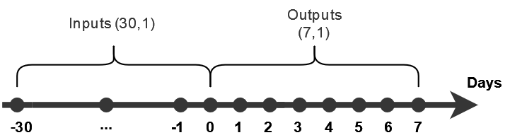

<!-- Improved compatibility of back to top link: See: https://github.com/othneildrew/Best-README-Template/pull/73 -->
<a name="readme-top"></a>
<!--
*** Thanks for checking out the Best-README-Template. If you have a suggestion
*** that would make this better, please fork the repo and create a pull request
*** or simply open an issue with the tag "enhancement".
*** Don't forget to give the project a star!
*** Thanks again! Now go create something AMAZING! :D
-->


<!-- PROJECT SHIELDS -->
<!--
*** I'm using markdown "reference style" links for readability.
*** Reference links are enclosed in brackets [ ] instead of parentheses ( ).
*** See the bottom of this document for the declaration of the reference variables
*** for contributors-url, forks-url, etc. This is an optional, concise syntax you may use.
*** https://www.markdownguide.org/basic-syntax/#reference-style-links
-->
[![LinkedIn][linkedin-shield]][linkedin-url]


<!-- PROJECT LOGO -->
<br />
<div align="center">
  <a href="http://ec2-18-212-239-239.compute-1.amazonaws.com/">
    
  </a>

<h1 align="center">Stock Prediction Simulator</h1>

</div>

* Stock Prediction Simulator is a Web Application that allows you to simulate trades on a given period, based on a machine learning model (Bi-LSTM). <br/>
* The application offers a dynamic candlestick chart, where you can supervise the predicted price, the information about the trades made, and the actual price of the stock. <br/>
* A trade table and an balance chart are also avaible, so that you can track the evolution of your account balance trade by trade.
* Web App Link : http://ec2-18-212-239-239.compute-1.amazonaws.com/
<br />
<br />

<!-- TABLE OF CONTENTS -->
<details>
  <summary>Table of Contents</summary>
  <ol>
    <li>
      <a href="#about-the-project">About The Project</a>
      <ul>
        <li><a href="#built-with">Built With</a></li>
      </ul>
    </li>
    <li>
      <a href="#dataset">Dataset</a>
      <ul>
        <li><a href="#yahoo-finance-api">Yahoo Finance API</a></li>
        <li><a href="#preprocessing">Preprocessing</a></li>
      </ul>
    </li>
    <li><a href="#model">Model</a></li>
    <li>
      <a href="#results">Results</a>
      <ul>
        <li><a href="#metrics">Metrics</a></li>
        <li><a href="#results-of-the-model">Results of the model</a></li>
      </ul>
    </li>
    <li><a href="#contact">Contact</a></li>
  </ol>
</details>


<!-- ABOUT THE PROJECT -->
## About The Project


https://user-images.githubusercontent.com/48710939/188311265-dafb77bc-0e8f-439a-96b4-950354fdfe43.mp4


<br />
<br />
<br />

### Built With

* [![Python][Python-logo]](https://pythonprogramming.net/)
* [![Streamlit][Streamlit-logo]](https://streamlit-io.translate.goog/?_x_tr_sl=en&_x_tr_tl=fr&_x_tr_hl=fr&_x_tr_pto=sc)
* [![Amazon][Amazon-logo]](https://aws.amazon.com/fr/ec2/)
* [![Docker][Docker-logo]](https://www.docker.com/)
* [![Plotly][Plotly-logo]](https://plotly.com/)
* [![Tensorflow][Tensorflow-logo]](https://www.tensorflow.org/)
* [![Yahoo Finance][Yahoo-Finance]](https://pypi.org/project/yfinance/)


<br />
<br />

<!-- Dataset -->
## Dataset

### Yahoo Finance API

#### a. Request
``` 
yfinance.download(tickers=TSLA,
		  start="2010-08-12",
		  end="2022-09-03",
		  interval="1d",
		  group_by='ticker',
		  # Mass Downloading
		  threads=True,
		  proxy=None
		 )
```

#### b. Response Format

| Date  | Open | High | Low | Close | Adj Close | Volume | 
| ----- | -----| ---- | ----| ----- | --------- | ------ |
| (Object) | (float64) | (float64) | (float64) | (float64) | (float64) | (int64) |


<br />

### Preprocessing

The goal of the model is to predict the close price for the next 7 days, based on the previous 30 days close prices.

<a>
    
</a>

This way we create a **train dataset** with a shape of **(batch_size, 30, 1)**, and a **test dataset** with a shape of **(batch_size, 7)**.

<br/>

<!-- Model -->
## Model

* At the preprocessing step, I managed to have inputs with a 3D shape, which is perfect for a Bidirectional Long Short Time Memory (Bi-LSTM) model. 

* The original **LSTM** or **Unidirectional LSTM** was developped to deal with the vanishing gradient problem, of the **Recurrent Neural Network (RNN)**, that was unabled to work with large inputs. <br/>
This **LSTM** is applicable to tasks involving a **chronological sequences**, such as speech or handwritting recognition, machine translation, or stock prediction in our case. <br/>

* The **Bidirectional LSTM model** works like the **unidirectional LSTM**, but it takes into consideration not only the past data, but also the future data, so that we can have a better understanding of the context.

### Model summary


|           Layer (type)        | Output Shape  | Param #  | 
| ----------------------------- | --------------| -------- |
| bidirectional (Bidirectional) | (None, 512)   | 528384   | 
| dropout (Dropout)             | (None, 512)   | 0        | 
| dense (Dense)                 | (None, 7)     | 3591     | 


Total params: 531,975 <br/>
Trainable params: 531,975 <br/>
Non-trainable params: 0 <br/>


<br/>
<br/>

<!-- Results -->
## Results

### Metrics

* **Mean Squared Error (MSE)** : <br/>
&nbsp;&nbsp;&nbsp;&nbsp;&nbsp;&nbsp; Measures the average magnitude of the error. <br/><br/>
&nbsp;&nbsp;&nbsp;&nbsp;&nbsp;&nbsp;&nbsp;&nbsp;&nbsp;&nbsp;&nbsp;&nbsp;&nbsp;&nbsp;&nbsp;&nbsp;&nbsp;&nbsp; MSE = $\frac{1}{n} \Sigma_{i=1}^n({y_{i}}-\hat{y_{i}})^2$

* **Mean Absolute Error (MAE)** : <br/>
&nbsp;&nbsp;&nbsp;&nbsp;&nbsp;&nbsp; Measures the average magnitude of the error, without considering their direction. <br/><br/>
&nbsp;&nbsp;&nbsp;&nbsp;&nbsp;&nbsp;&nbsp;&nbsp;&nbsp;&nbsp;&nbsp;&nbsp;&nbsp;&nbsp;&nbsp;&nbsp;&nbsp;&nbsp; MAE = $\frac{1}{n} \Sigma_{i=1}^{n}|y_i-\hat{y_{i}}|$

### Results of the model

| MAE | MSE  | 
| ------ | ------ | 
| 0.0460 | 0.0039 | 

<!-- CONTACT -->
## Contact

Thibaut ESCHOUA

Project Link: [Stock Prediction Simulator](http://ec2-18-212-239-239.compute-1.amazonaws.com/) <br/>
Linkedin : [Linkedin Thibaut ESCHOUA](https://www.linkedin.com/in/thibaut-eschoua/)

<p align="right">(<a href="#readme-top">back to top</a>)</p>


<!-- MARKDOWN LINKS & IMAGES -->
<!-- https://www.markdownguide.org/basic-syntax/#reference-style-links -->
[contributors-shield]: https://img.shields.io/github/contributors/github_username/repo_name.svg?style=for-the-badge
[contributors-url]: https://github.com/github_username/repo_name/graphs/contributors
[forks-shield]: https://img.shields.io/github/forks/github_username/repo_name.svg?style=for-the-badge
[forks-url]: https://github.com/github_username/repo_name/network/members
[stars-shield]: https://img.shields.io/github/stars/github_username/repo_name.svg?style=for-the-badge
[stars-url]: https://github.com/github_username/repo_name/stargazers
[issues-shield]: https://img.shields.io/github/issues/github_username/repo_name.svg?style=for-the-badge
[issues-url]: https://github.com/github_username/repo_name/issues
[license-shield]: https://img.shields.io/github/license/github_username/repo_name.svg?style=for-the-badge
[license-url]: https://github.com/github_username/repo_name/blob/master/LICENSE.txt
[linkedin-shield]: https://img.shields.io/badge/-LinkedIn-black.svg?style=for-the-badge&logo=linkedin&colorB=555
[linkedin-url]: https://www.linkedin.com/in/thibaut-eschoua/
[product-screenshot]: images/screenshot.png
[Python-logo]: https://img.shields.io/badge/Python-20232A?style=for-the-badge&logo=python&logoColor=white
[Yahoo-Finance]: https://img.shields.io/badge/Yahoo%20Finance%20API-6001D2?style=for-the-badge&logo=yahoo&logoColor=white
[Streamlit-logo]: https://img.shields.io/badge/Streamlit-FF4B4B?style=for-the-badge&logo=streamlit&logoColor=white
[Plotly-logo]: https://img.shields.io/badge/Plotly-3F4F75?style=for-the-badge&logo=plotly&logoColor=white
[Amazon-logo]: https://img.shields.io/badge/Amazon%20EC2-FF9900?style=for-the-badge&logo=amazon%20ec2&logoColor=white
[Docker-logo]: https://img.shields.io/badge/Docker-2496ED?style=for-the-badge&logo=docker&logoColor=white
[Tensorflow-logo]: https://img.shields.io/badge/Tensorflow-FF6F00?style=for-the-badge&logo=tensorflow&logoColor=white
